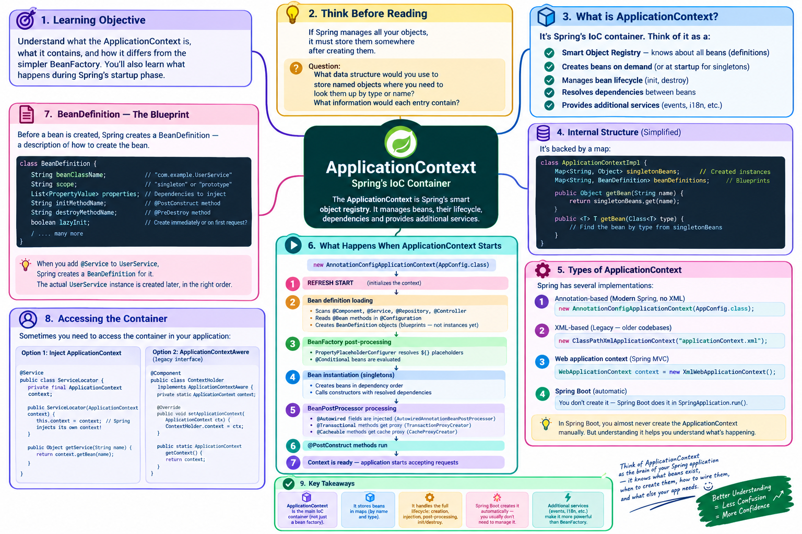

# Lesson 02-03 — ApplicationContext



## 🎯 Learning Objective

Understand what the `ApplicationContext` is, what it contains, and how it differs from the simpler `BeanFactory`. You'll understand what happens during Spring's startup phase.

---

## 🤔 Think Before Reading

If Spring manages all your objects, it must store them somewhere after creating them.

**Question**: What data structure would you use to store named objects where you need to look them up by type or name? What information would each entry need to contain?

---

## 🧠 The ApplicationContext — Spring's Container

The `ApplicationContext` is Spring's IoC container. Think of it as a:

```
Smart Object Registry
├── Knows about all beans (their definitions)
├── Creates beans on demand (or at startup for singletons)
├── Manages bean lifecycle (init, destroy)
├── Resolves dependencies between beans
└── Provides additional services (events, i18n, etc.)
```

Internally, it's backed by a map:

```java
// Conceptual view (simplified)
class ApplicationContextImpl {
    Map<String, Object> singletonBeans;           // Created instances
    Map<String, BeanDefinition> beanDefinitions;  // Blueprints for beans
    
    public Object getBean(String name) {
        return singletonBeans.get(name);
    }
    
    public <T> T getBean(Class<T> type) {
        // Find the bean by type from singletonBeans
    }
}
```

---

## 💻 ApplicationContext — Types

Spring has several ApplicationContext implementations:

```java
// 1. Annotation-based (Modern Spring, no XML)
ApplicationContext context = new AnnotationConfigApplicationContext(AppConfig.class);

// 2. XML-based (Legacy — you'll see this in older codebases)
ApplicationContext context = new ClassPathXmlApplicationContext("applicationContext.xml");

// 3. Web application context (Spring MVC)
WebApplicationContext context = new XmlWebApplicationContext();

// 4. Spring Boot creates this automatically
// You don't create it — Spring Boot does it in SpringApplication.run()
```

In Spring Boot, you almost never create the ApplicationContext manually. But understanding it helps you understand what's happening.

---

## 🔍 What Happens When ApplicationContext Starts

```
new AnnotationConfigApplicationContext(AppConfig.class)
           ↓
1. REFRESH START
           ↓
2. Bean definition loading
   - Scans @Component, @Service, @Repository, @Controller classes
   - Reads @Bean methods in @Configuration classes
   - Creates BeanDefinition objects (blueprints — not instances yet)
           ↓
3. BeanFactory post-processing
   - PropertyPlaceholderConfigurer resolves ${} placeholders
   - @Conditional beans are evaluated (should this bean be created?)
           ↓
4. Bean instantiation (singletons)
   - Creates beans in dependency order
   - Calls constructors with resolved dependencies
           ↓
5. BeanPostProcessor processing
   - @Autowired fields are injected (AutowiredAnnotationBeanPostProcessor)
   - @Transactional methods get proxy wrapper (TransactionProxyCreator)
   - @Cacheable methods get cache proxy (CacheProxyCreator)
           ↓
6. @PostConstruct methods run
           ↓
7. Context is ready — application starts accepting requests
```

---

## 💻 BeanDefinition — The Blueprint

Before a bean is created, Spring creates a `BeanDefinition` — a description of how to create the bean:

```java
// Conceptual BeanDefinition (what Spring stores internally)
class BeanDefinition {
    String beanClassName;           // "com.example.UserService"
    String scope;                   // "singleton" or "prototype"
    List<PropertyValue> properties; // Dependencies to inject
    String initMethodName;          // @PostConstruct method
    String destroyMethodName;       // @PreDestroy method
    boolean lazyInit;               // Create immediately or on first request?
    // ... many more
}
```

When you add `@Service` to `UserService`, Spring creates a `BeanDefinition` for it. The actual `UserService` instance is created later, in the right order.

---

## 🔍 Accessing the Container

In application code, you occasionally need to access the container:

```java
// Option 1: ApplicationContext as a dependency
@Service
public class ServiceLocator {
    private final ApplicationContext context;
    
    public ServiceLocator(ApplicationContext context) {
        this.context = context; // Spring injects its own context!
    }
    
    // Dynamic bean lookup by name
    public Object getService(String name) {
        return context.getBean(name);
    }
}

// Option 2: ApplicationContextAware (legacy interface)
@Component
public class ContextHolder implements ApplicationContextAware {
    private static ApplicationContext context;
    
    @Override
    public void setApplicationContext(ApplicationContext ctx) {
        ContextHolder.context = ctx;
    }
    
    public static ApplicationContext getContext() {
        return context;
    }
}
```

> **Caution**: Accessing the ApplicationContext directly is generally an anti-pattern. Use DI instead. Only access the context directly for dynamic, runtime bean lookups (rare).

---

## 🏗️ Hierarchy: ApplicationContext vs BeanFactory

```
BeanFactory (simple)
    └── ApplicationContext (extended)
            ├── BeanFactory features (get beans, manage lifecycle)
            ├── MessageSource (internationalization)
            ├── ApplicationEventPublisher (event system)
            ├── ResourceLoader (load files)
            └── Environment (profiles, properties)
```

`BeanFactory` is the basic contract. `ApplicationContext` extends it with enterprise features.

In Spring Boot, you always work with `ApplicationContext`.

---

## 🔍 Spring Boot's ApplicationContext

When you run:

```java
@SpringBootApplication
public class MyApplication {
    public static void main(String[] args) {
        SpringApplication.run(MyApplication.class, args);
    }
}
```

Spring Boot:
1. Creates a `AnnotationConfigServletWebServerApplicationContext` (web app) or `AnnotationConfigApplicationContext` (non-web)
2. Runs the `refresh()` sequence above
3. Starts the embedded Tomcat server
4. Returns the `ApplicationContext` (which you can also capture if needed)

```java
// Capturing the context (rarely needed)
ConfigurableApplicationContext context = SpringApplication.run(MyApplication.class, args);

// Now you can query it
UserService userService = context.getBean(UserService.class);
```

---

## 🔍 ApplicationContext Events

The ApplicationContext publishes events at key moments:

```java
@Component
public class StartupListener {
    
    // Called after context is fully started
    @EventListener
    public void onStartup(ApplicationReadyEvent event) {
        System.out.println("Application is ready!");
    }
    
    // Called when context is being destroyed (app shutdown)
    @EventListener
    public void onShutdown(ContextClosedEvent event) {
        System.out.println("Application shutting down...");
    }
}
```

You can also publish custom events:

```java
// Publisher
@Service
public class OrderService {
    private final ApplicationEventPublisher eventPublisher;
    
    public OrderService(ApplicationEventPublisher eventPublisher) {
        this.eventPublisher = eventPublisher;
    }
    
    public void placeOrder(Order order) {
        // ... save order
        eventPublisher.publishEvent(new OrderPlacedEvent(order));
    }
}

// Listener
@Component
public class OrderNotificationService {
    
    @EventListener
    public void onOrderPlaced(OrderPlacedEvent event) {
        // Send email, update inventory, etc.
    }
}
```

This event system decouples components — `OrderService` doesn't know about `OrderNotificationService`.

---

## 💥 Break It Exercise

What happens when you run this?

```java
@SpringBootApplication
public class App {
    public static void main(String[] args) {
        ConfigurableApplicationContext context = SpringApplication.run(App.class, args);
        
        UserService service1 = context.getBean(UserService.class);
        UserService service2 = context.getBean(UserService.class);
        
        System.out.println(service1 == service2); // What prints?
    }
}
```

<details>
<summary>Answer</summary>

**Prints: `true`**

By default, Spring beans are **singletons** — one instance per container. `service1` and `service2` are the same object.

`==` in Java compares references (memory address). Since they're the same object, they have the same reference → `true`.

This is why Spring is safe to use in concurrent environments — singletons should be stateless (no instance variables that change per request).

</details>

---

## 🎯 Practice Exercise

Given these classes:

```java
@Service
public class DatabaseService {
    public DatabaseService() {
        System.out.println("DatabaseService created");
    }
}

@Service
public class CacheService {
    public CacheService() {
        System.out.println("CacheService created");
    }
}

@Service
public class AppService {
    private final DatabaseService databaseService;
    private final CacheService cacheService;
    
    public AppService(DatabaseService databaseService, CacheService cacheService) {
        System.out.println("AppService created");
        this.databaseService = databaseService;
        this.cacheService = cacheService;
    }
}
```

**Questions**:
1. What order will the "created" messages print?
2. What annotation is missing to make this work?
3. If you call `context.getBean(AppService.class)` twice, how many "AppService created" messages will you see?

<details>
<summary>Answers</summary>

1. **Order**: `DatabaseService created`, then `CacheService created`, then `AppService created`. Spring creates dependencies first.

2. **Missing**: Nothing specific — `@Service` is on all three. But you need `@SpringBootApplication` or `@ComponentScan` to scan the package. And a main class with `SpringApplication.run()`.

3. **Once** — beans are singletons. The second call returns the existing instance.

</details>

---

## ✅ Completion Checklist

- [ ] Can you explain what the ApplicationContext is?
- [ ] Can you describe what happens during `refresh()` in 4-5 steps?
- [ ] Can you explain the difference between BeanFactory and ApplicationContext?
- [ ] Can you explain why bean singletons are important and what constraint they impose?
- [ ] Do you understand what a BeanDefinition is?

---

*Next: [02-04 — Beans and Lifecycle](./04-beans-and-lifecycle.md)*
