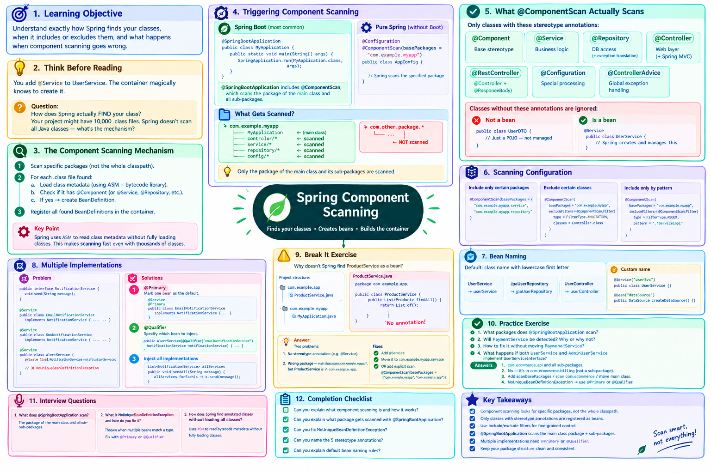

# Lesson 02-05 — Component Scanning



## 🎯 Learning Objective

Understand exactly how Spring finds your classes, when it includes or excludes them, and what happens when component scanning goes wrong.

---

## 🤔 Think Before Reading

You add `@Service` to `UserService`. The Spring container magically knows to create it.

**Question**: How does Spring actually FIND your class? Your project might have 10,000 .class files. Spring doesn't scan all Java classes on the classpath — that would take forever.

What do you think the mechanism is?

---

## 🔍 Component Scanning — The Mechanism

When Spring starts, it performs a **classpath scan** within specific packages.

```
1. "Scan everything in package: com.example.myapp"
2. For each .class file found:
   a. Load the class metadata (without fully loading the class)
   b. Check if it has @Component (or @Service, @Repository, @Controller, etc.)
   c. If yes → create a BeanDefinition for it
3. Register all found BeanDefinitions in the container
```

Spring reads class metadata using ASM (a bytecode manipulation library) — it doesn't fully load every class. This makes scanning fast even with thousands of classes.

---

## 💻 Triggering Component Scanning

### In Spring Boot (most common)

```java
@SpringBootApplication
public class MyApplication {
    public static void main(String[] args) {
        SpringApplication.run(MyApplication.class, args);
    }
}
```

`@SpringBootApplication` includes `@ComponentScan`, which scans **the package of the main class and all sub-packages**.

```
com.example.myapp.MyApplication  ← @SpringBootApplication here
com.example.myapp.controller.*   ← scanned
com.example.myapp.service.*      ← scanned
com.example.myapp.repository.*   ← scanned
com.example.myapp.config.*       ← scanned

com.other.package.*              ← NOT scanned (different package)
```

### In pure Spring (without Spring Boot)

```java
@Configuration
@ComponentScan(basePackages = "com.example.myapp")
public class AppConfig {
    // Spring scans the specified package
}
```

---

## 🔍 What @ComponentScan Actually Scans

Not all classes — only those with stereotype annotations:

```java
@Component          // The base stereotype
@Service            // Specialized @Component
@Repository         // Specialized @Component (+ DB exception translation)
@Controller         // Specialized @Component (+ Spring MVC handling)
@RestController     // Specialized @Controller
@Configuration      // Specialized @Component (has special processing)
@ControllerAdvice   // Specialized @Component
```

Classes without these annotations are ignored during scanning:

```java
// This class is NOT a bean — no annotation
public class UserDTO {
    // Just a POJO — used for data transfer, not managed by Spring
}

// This IS a bean
@Service
public class UserService {
    // Spring creates and manages this
}
```

---

## 🏗️ Scanning Configuration

### Include only certain packages

```java
@SpringBootApplication
@ComponentScan(basePackages = {
    "com.example.myapp.service",
    "com.example.myapp.repository"
})
public class MyApplication { ... }
```

### Exclude certain classes

```java
@SpringBootApplication
@ComponentScan(
    basePackages = "com.example.myapp",
    excludeFilters = @ComponentScan.Filter(
        type = FilterType.ANNOTATION,
        classes = Controller.class
    )
)
public class MyApplication { ... }
```

### Include only classes matching a pattern

```java
@ComponentScan(
    basePackages = "com.example.myapp",
    includeFilters = @ComponentScan.Filter(
        type = FilterType.REGEX,
        pattern = ".*ServiceImpl"
    )
)
```

---

## 🔍 Bean Naming

By default, Spring names beans using the class name with a lowercase first letter:

```java
@Service
public class UserService {}      // Bean name: "userService"

@Repository
public class JpaUserRepository {} // Bean name: "jpaUserRepository"

@RestController
public class UserController {}    // Bean name: "userController"
```

You can specify a custom name:

```java
@Service("userSvc")
public class UserService {}      // Bean name: "userSvc"

@Bean("dataSource")
public DataSource createDataSource() { ... } // Bean name: "dataSource"
```

---

## ❓ What Happens With Multiple Implementations?

```java
public interface NotificationService {
    void send(String message);
}

@Service
public class EmailNotificationService implements NotificationService {
    @Override
    public void send(String message) { /* email */ }
}

@Service
public class SmsNotificationService implements NotificationService {
    @Override
    public void send(String message) { /* SMS */ }
}

@Service
public class AlertService {
    private final NotificationService notificationService; // Which one?!
    
    public AlertService(NotificationService notificationService) {
        // Spring throws: NoUniqueBeanDefinitionException
        // "expected single matching bean but found 2: 
        //  emailNotificationService, smsNotificationService"
    }
}
```

**Fix 1**: `@Primary` — mark one as the default

```java
@Service
@Primary // This is the default when multiple implementations exist
public class EmailNotificationService implements NotificationService { ... }
```

**Fix 2**: `@Qualifier` — specify which one to inject

```java
@Service
public class AlertService {
    private final NotificationService notificationService;
    
    public AlertService(@Qualifier("emailNotificationService") NotificationService notificationService) {
        this.notificationService = notificationService;
    }
}
```

**Fix 3**: Inject all implementations

```java
@Service
public class NotificationRouter {
    private final List<NotificationService> allServices;
    
    // Spring injects ALL implementations of the interface
    public NotificationRouter(List<NotificationService> allServices) {
        this.allServices = allServices;
    }
    
    public void sendAll(String message) {
        allServices.forEach(s -> s.send(message));
    }
}
```

---

## 💥 Break It Exercise

Why doesn't Spring find `ProductService` as a bean?

```java
// File location: com.example.app.ProductService
package com.example.app;

// No annotations
public class ProductService {
    public List<Product> findAll() {
        return List.of();
    }
}

// Main class location: com.example.myapp.MyApplication
package com.example.myapp;

@SpringBootApplication
public class MyApplication {
    public static void main(String[] args) {
        SpringApplication.run(MyApplication.class, args);
    }
}
```

<details>
<summary>Answer</summary>

Two problems:

1. **No stereotype annotation**: `ProductService` has no `@Service`, `@Component`, etc.

2. **Wrong package**: The main class is in `com.example.myapp`, so `@ComponentScan` scans `com.example.myapp.*`. But `ProductService` is in `com.example.app` — a different package not covered by the scan.

Fixes:
- Add `@Service` to `ProductService`
- Move `ProductService` to `com.example.myapp.service.ProductService`
- OR add explicit scan: `@ComponentScan(basePackages = {"com.example.myapp", "com.example.app"})`

The package structure mistake is extremely common for beginners.

</details>

---

## 🎯 Practice Exercise

Given this structure:

```
com.ecommerce.api.EcommerceApplication    ← Main class
com.ecommerce.api.controller.UserController
com.ecommerce.api.service.UserService
com.ecommerce.api.repository.UserRepository
com.ecommerce.billing.PaymentService      ← Different package!
```

Questions:
1. What packages does `@SpringBootApplication` scan by default?
2. Will `PaymentService` be detected? Why or why not?
3. How would you fix it without moving `PaymentService`?
4. If both `UserService` and a new `AdminUserService` implement `UserServiceInterface`, what happens when `UserController` tries to inject `UserServiceInterface`?

<details>
<summary>Answers</summary>

1. Scans `com.ecommerce.api` and all sub-packages.

2. **No** — `com.ecommerce.billing` is not a sub-package of `com.ecommerce.api`.

3. Fix options:
   - `@SpringBootApplication(scanBasePackages = {"com.ecommerce.api", "com.ecommerce.billing"})`
   - Add `@ComponentScan(basePackages = "com.ecommerce")` to scan the common root
   - Move `EcommerceApplication` to `com.ecommerce` (scan broader package)

4. `NoUniqueBeanDefinitionException` — two beans match `UserServiceInterface`. Fix with `@Primary` or `@Qualifier`.

</details>

---

## 🎤 Interview Questions

1. **What does `@SpringBootApplication` scan?**
   > The package of the main class and all sub-packages.

2. **What is `NoUniqueBeanDefinitionException` and how do you fix it?**
   > Thrown when Spring finds multiple beans matching a required type. Fix with `@Primary` (default bean) or `@Qualifier("beanName")` (specify which).

3. **How does Spring find your annotated classes without loading all classes?**
   > Spring uses ASM to read bytecode metadata without fully loading classes. It checks for component annotations in the metadata without executing the class.

---

## ✅ Completion Checklist

- [ ] Can you explain what component scanning is and how it works?
- [ ] Can you explain what package gets scanned with `@SpringBootApplication`?
- [ ] Can you fix `NoUniqueBeanDefinitionException`?
- [ ] Can you name the 5 stereotype annotations?
- [ ] Can you explain default bean naming rules?

---

*Next: [02-06 — Configuration](./06-configuration.md)*
