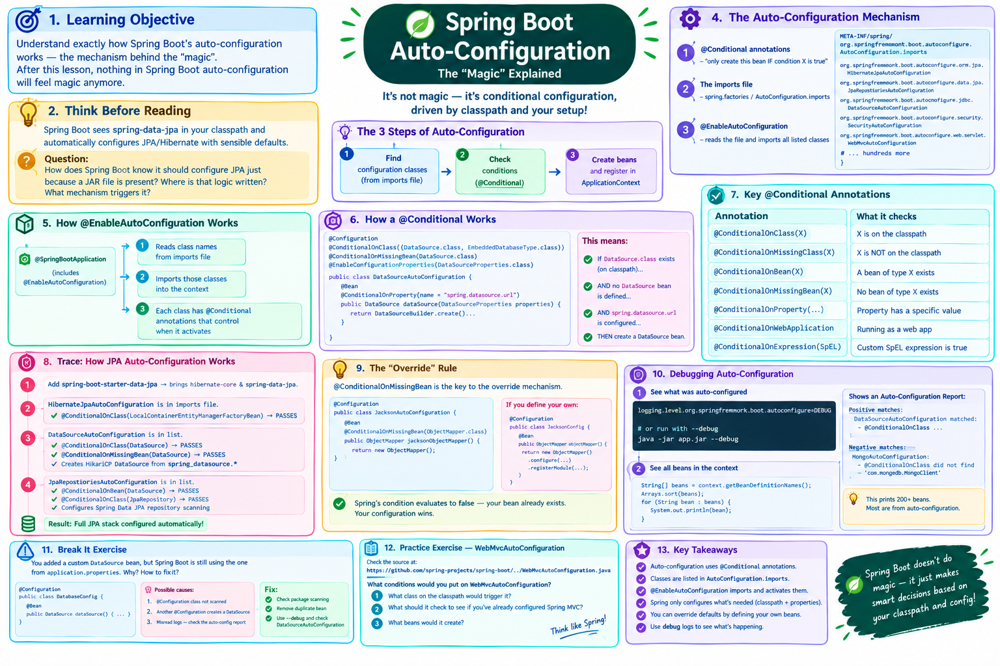
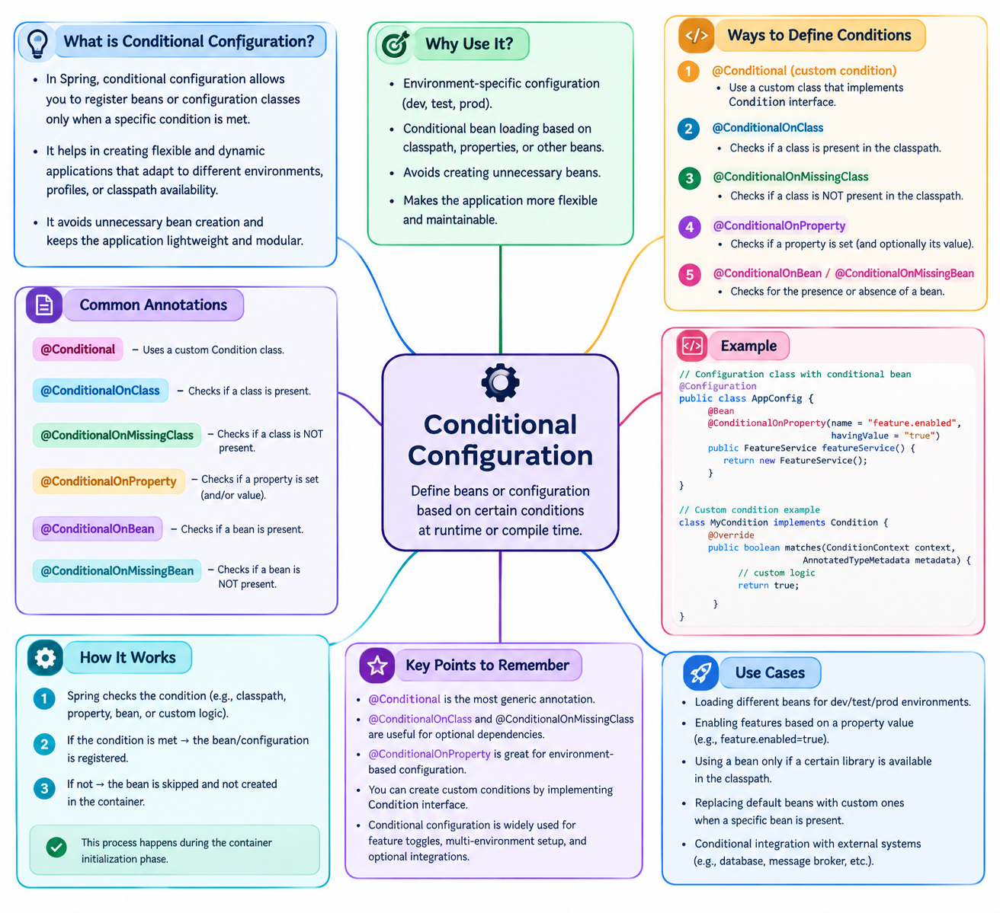

# Lesson 03-02 — Auto-Configuration



## 🎯 Learning Objective

Understand exactly HOW Spring Boot's auto-configuration works — the mechanism behind the "magic". After this lesson, nothing in Spring Boot auto-configuration will feel magic anymore.

---

## 🤔 Think Before Reading

Spring Boot sees `spring-data-jpa` in your classpath and automatically configures JPA/Hibernate with sensible defaults.

**Question**: How does Spring Boot know it should configure JPA just because a JAR file is present? Where is that logic written? What mechanism triggers it?

---

## 🔍 The Auto-Configuration Mechanism

Spring Boot's auto-configuration is implemented using:

1. **`@Conditional` annotations** — "only create this bean IF condition X is true"
2. **`spring.factories` / `AutoConfiguration.imports` file** — a list of all auto-configuration classes
3. **`@EnableAutoConfiguration`** — reads that file and imports all listed classes

### Step 1: The Imports File

Every Spring Boot starter JAR contains a file at:

```
META-INF/spring/org.springframework.boot.autoconfigure.AutoConfiguration.imports
```

(In older versions: `META-INF/spring.factories`)

This file lists all auto-configuration classes:

```
org.springframework.boot.autoconfigure.orm.jpa.HibernateJpaAutoConfiguration
org.springframework.boot.autoconfigure.data.jpa.JpaRepositoriesAutoConfiguration
org.springframework.boot.autoconfigure.jdbc.DataSourceAutoConfiguration
org.springframework.boot.autoconfigure.security.servlet.SecurityAutoConfiguration
org.springframework.boot.autoconfigure.web.servlet.WebMvcAutoConfiguration
org.springframework.boot.autoconfigure.jackson.JacksonAutoConfiguration
# ... hundreds more
```

### Step 2: @EnableAutoConfiguration Reads This File

`@SpringBootApplication` includes `@EnableAutoConfiguration`, which:
1. Reads all auto-configuration class names from the imports file
2. Imports those classes into the Spring context
3. Each class is annotated with `@Conditional*` annotations that control WHEN they activate

### Step 3: @Conditional — The Guard

```java
@Configuration
@ConditionalOnClass({DataSource.class, EmbeddedDatabaseType.class})  // ← Only if these classes exist
@ConditionalOnMissingBean(DataSource.class)                           // ← Only if no DataSource already exists
@EnableConfigurationProperties(DataSourceProperties.class)
public class DataSourceAutoConfiguration {
    
    @Bean
    @ConditionalOnProperty(name = "spring.datasource.url")            // ← Only if URL is configured
    public DataSource dataSource(DataSourceProperties properties) {
        return DataSourceBuilder.create()
            .url(properties.getUrl())
            .username(properties.getUsername())
            .password(properties.getPassword())
            .build();
    }
}
```

**Translation of this logic**:
- "If `DataSource.class` exists on the classpath (i.e., any JDBC driver is present)..."
- "AND if no `DataSource` bean has been manually defined..."
- "AND if `spring.datasource.url` is configured..."
- "THEN create a `DataSource` bean automatically."

---

## 📋 Key @Conditional Annotations



| Annotation | Condition |
|------------|-----------|
| `@ConditionalOnClass(X.class)` | X is on the classpath |
| `@ConditionalOnMissingClass(X.class)` | X is NOT on the classpath |
| `@ConditionalOnBean(X.class)` | A bean of type X exists |
| `@ConditionalOnMissingBean(X.class)` | No bean of type X exists |
| `@ConditionalOnProperty(name, havingValue)` | Property has a specific value |
| `@ConditionalOnWebApplication` | Running as a web app |
| `@ConditionalOnExpression(SpEL)` | Custom SpEL expression is true |

---

## 🔍 Trace: How JPA Auto-Configuration Works

When you add `spring-boot-starter-data-jpa`:

```xml
<dependency>
    <groupId>org.springframework.boot</groupId>
    <artifactId>spring-boot-starter-data-jpa</artifactId>
</dependency>
```

This brings `hibernate-core.jar` and `spring-data-jpa.jar` to your classpath.

Spring Boot's auto-configuration process:

```
1. @EnableAutoConfiguration reads AutoConfiguration.imports

2. HibernateJpaAutoConfiguration is in the list
   - @ConditionalOnClass(LocalContainerEntityManagerFactoryBean.class)
   → hibernate-core is on classpath, so LocalContainerEntityManagerFactoryBean exists
   → Condition PASSES

3. DataSourceAutoConfiguration is in the list
   - @ConditionalOnClass(DataSource.class) → PASSES
   - @ConditionalOnMissingBean(DataSource.class) → no manual DataSource → PASSES
   - Creates HikariCP DataSource from spring.datasource.* properties

4. JpaRepositoriesAutoConfiguration is in the list
   - @ConditionalOnBean(DataSource.class) → DataSource was just created → PASSES
   - @ConditionalOnClass(JpaRepository.class) → spring-data-jpa is present → PASSES
   - Configures Spring Data JPA repository scanning

5. Result: Full JPA stack configured automatically
```

---

## 💡 The "Override" Rule

`@ConditionalOnMissingBean` is the key to the override mechanism:

```java
// Spring Boot's auto-configured ObjectMapper:
@Bean
@ConditionalOnMissingBean(ObjectMapper.class) // ← Only if you haven't defined one
public ObjectMapper jacksonObjectMapper() {
    return new ObjectMapper(); // Spring Boot's default
}
```

If you define your own:

```java
@Configuration
public class JacksonConfig {
    @Bean
    public ObjectMapper objectMapper() {
        // Your custom ObjectMapper
        return new ObjectMapper()
            .configure(SerializationFeature.WRITE_DATES_AS_TIMESTAMPS, false)
            .registerModule(new JavaTimeModule());
    }
}
```

Spring's condition `@ConditionalOnMissingBean(ObjectMapper.class)` evaluates to **false** — your bean already exists. Spring Boot's default is skipped. Your configuration wins.

**This is how you override any Spring Boot default.**

---

## 🛠️ Debugging Auto-Configuration

### See what was auto-configured

Add to `application.properties`:
```properties
logging.level.org.springframework.boot.autoconfigure=DEBUG
```

Or run with `--debug` flag:
```bash
java -jar myapp.jar --debug
```

This prints an "Auto-Configuration Report" showing:
```
Positive matches (auto-configured):
   DataSourceAutoConfiguration matched:
      - @ConditionalOnClass found required classes... (OnClassCondition)
   
Negative matches (did NOT auto-configure):
   MongoAutoConfiguration:
      - @ConditionalOnClass did not find required class 'com.mongodb.MongoClient'
```

### See all beans in the context

```java
@SpringBootApplication
public class App {
    public static void main(String[] args) {
        ApplicationContext context = SpringApplication.run(App.class, args);
        
        // Print all bean names
        String[] beans = context.getBeanDefinitionNames();
        Arrays.sort(beans);
        for (String bean : beans) {
            System.out.println(bean);
        }
    }
}
```

This prints 200+ beans. Most are from auto-configuration.

---

## 💥 Break It Exercise

You've added a custom `DataSource` bean:

```java
@Configuration
public class DatabaseConfig {
    @Bean
    public DataSource dataSource() {
        HikariDataSource ds = new HikariDataSource();
        ds.setJdbcUrl("jdbc:postgresql://custom-host/mydb");
        ds.setUsername("admin");
        ds.setPassword("secure-password");
        return ds;
    }
}
```

But Spring Boot is STILL using the DataSource from `spring.datasource.url` in `application.properties`.

**Question**: What's happening? How do you fix it?

<details>
<summary>Answer</summary>

Actually — if you define a `DataSource` bean yourself, Spring Boot's `DataSourceAutoConfiguration` should NOT activate because it has `@ConditionalOnMissingBean(DataSource.class)`.

If it seems like it's using the wrong DataSource, possible causes:
1. The `@Configuration` class is in a package not scanned by `@SpringBootApplication`
2. There's another `@Configuration` that's also creating a `DataSource`
3. You misread the logs — check which host is being connected to

To debug: Check the auto-configuration report with `--debug` and search for `DataSourceAutoConfiguration`.

This is the right debugging approach: look at what Spring REPORTS, not what you assume.

</details>

---

## 🎯 Practice Exercise — Read Auto-Configuration

Open the Spring Boot source on GitHub and find `WebMvcAutoConfiguration`:

`https://github.com/spring-projects/spring-boot/blob/main/spring-boot-project/spring-boot-autoconfigure/src/main/java/org/springframework/boot/autoconfigure/web/servlet/WebMvcAutoConfiguration.java`

Or just think: What conditions would you put on `WebMvcAutoConfiguration`?

1. What class on the classpath would trigger it?
2. What should it check to see if you've already configured Spring MVC?
3. What beans would it create?

Then check if your predictions are right.

<details>
<summary>Expected Answers</summary>

1. **Trigger**: `@ConditionalOnClass(DispatcherServlet.class)` — Spring MVC must be on classpath

2. **Already configured check**: `@ConditionalOnMissingBean(WebMvcConfigurationSupport.class)` — if you've extended `WebMvcConfigurationSupport` yourself, auto-config steps back

3. **Beans it creates**:
   - `RequestMappingHandlerMapping` (routes HTTP requests to controllers)
   - `RequestMappingHandlerAdapter` (processes controller methods)
   - `ContentNegotiationManager` (handles JSON/XML negotiation)
   - `InternalResourceViewResolver` (for view resolution)
   - `HandlerExceptionResolverComposite` (exception handling)
   - Jackson `ObjectMapper` (JSON serialization)

</details>

---

## ✅ Completion Checklist

- [ ] Can you explain the auto-configuration mechanism in 3 steps?
- [ ] Can you name 4 `@Conditional` annotations and what they check?
- [ ] Can you explain how to override a Spring Boot auto-configured bean?
- [ ] Can you enable auto-configuration debug logging?
- [ ] Can you trace how JPA gets auto-configured when the starter is added?

---

*Next: [03-03 — Starters](./03-starters.md)*
