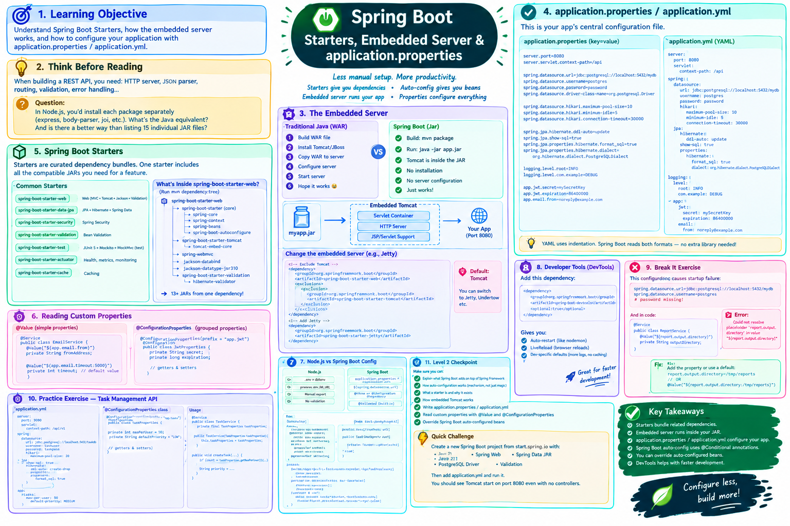

# Lesson 03-03 — Starters, Embedded Server & application.properties



## 🎯 Learning Objective

Understand Spring Boot Starters, how the embedded server works, and how to configure your application with `application.properties` / `application.yml`.

---

## 🤔 Think Before Reading

When building a REST API, you need: HTTP server, JSON parser, routing, validation, error handling...

**Question**: In Node.js, you'd install each package separately (`express`, `body-parser`, `joi`, etc.). What's the Java equivalent? And is there a better way than listing 15 individual JAR files?

---

## 📦 Spring Boot Starters

Starters are **curated dependency bundles**. One starter includes all the compatible JARs you need for a feature.

### Most Common Starters

```xml
<!-- pom.xml -->

<!-- Web: Spring MVC + Tomcat + Jackson + Validation -->
<dependency>
    <groupId>org.springframework.boot</groupId>
    <artifactId>spring-boot-starter-web</artifactId>
</dependency>

<!-- JPA + Hibernate + Spring Data -->
<dependency>
    <groupId>org.springframework.boot</groupId>
    <artifactId>spring-boot-starter-data-jpa</artifactId>
</dependency>

<!-- Spring Security -->
<dependency>
    <groupId>org.springframework.boot</groupId>
    <artifactId>spring-boot-starter-security</artifactId>
</dependency>

<!-- Bean Validation -->
<dependency>
    <groupId>org.springframework.boot</groupId>
    <artifactId>spring-boot-starter-validation</artifactId>
</dependency>

<!-- Testing: JUnit 5 + Mockito + MockMvc -->
<dependency>
    <groupId>org.springframework.boot</groupId>
    <artifactId>spring-boot-starter-test</artifactId>
    <scope>test</scope>
</dependency>

<!-- Spring Actuator (health, metrics) -->
<dependency>
    <groupId>org.springframework.boot</groupId>
    <artifactId>spring-boot-starter-actuator</artifactId>
</dependency>

<!-- Caching -->
<dependency>
    <groupId>org.springframework.boot</groupId>
    <artifactId>spring-boot-starter-cache</artifactId>
</dependency>
```

### What's Inside spring-boot-starter-web?

Run `mvn dependency:tree` in a Spring Boot project. You'll see `spring-boot-starter-web` brings:

```
spring-boot-starter-web
├── spring-boot-starter (core)
│   ├── spring-core
│   ├── spring-context
│   ├── spring-beans
│   └── spring-boot-autoconfigure
├── spring-boot-starter-tomcat (embedded server)
│   └── tomcat-embed-core
├── spring-webmvc (Spring MVC framework)
├── jackson-databind (JSON serialization)
├── jackson-datatype-jsr310 (Java 8 date/time)
└── spring-boot-starter-validation
    └── hibernate-validator
```

13+ JARs from one dependency.

---

## 🖥️ The Embedded Server

### How traditional Java apps deployed

```
1. Package application as WAR file
2. Install Tomcat/JBoss/WebLogic on server
3. Copy WAR to server
4. Configure server
5. Start server
6. Hope it works
```

### How Spring Boot works

```
1. Build: mvn package → myapp.jar
2. Run: java -jar myapp.jar
3. Done. Tomcat is inside the JAR.
```

### Why this matters

```bash
# Docker:
FROM openjdk:21
COPY target/myapp.jar app.jar
ENTRYPOINT ["java", "-jar", "/app.jar"]

# No Tomcat installation needed!
# No server configuration!
# The app IS the server.
```

### Changing the embedded server

By default: Tomcat. To switch to Jetty:

```xml
<dependency>
    <groupId>org.springframework.boot</groupId>
    <artifactId>spring-boot-starter-web</artifactId>
    <exclusions>
        <exclusion>
            <groupId>org.springframework.boot</groupId>
            <artifactId>spring-boot-starter-tomcat</artifactId>
        </exclusion>
    </exclusions>
</dependency>

<dependency>
    <groupId>org.springframework.boot</groupId>
    <artifactId>spring-boot-starter-jetty</artifactId>
</dependency>
```

---

## ⚙️ application.properties

This is your app's central configuration file.

```
src/
└── main/
    └── resources/
        └── application.properties  ← here
```

### Common properties

```properties
# Server
server.port=8080
server.servlet.context-path=/api

# Database
spring.datasource.url=jdbc:postgresql://localhost:5432/mydb
spring.datasource.username=postgres
spring.datasource.password=password
spring.datasource.driver-class-name=org.postgresql.Driver

# Connection Pool (HikariCP)
spring.datasource.hikari.maximum-pool-size=10
spring.datasource.hikari.minimum-idle=5
spring.datasource.hikari.connection-timeout=30000

# JPA / Hibernate
spring.jpa.hibernate.ddl-auto=update          # create, create-drop, update, validate, none
spring.jpa.show-sql=true                      # Log SQL statements
spring.jpa.properties.hibernate.format_sql=true
spring.jpa.properties.hibernate.dialect=org.hibernate.dialect.PostgreSQLDialect

# Logging
logging.level.root=INFO
logging.level.com.example=DEBUG               # Debug your own code
logging.level.org.hibernate.SQL=DEBUG         # See SQL
logging.level.org.springframework.security=DEBUG

# Custom properties
app.jwt.secret=mySecretKey
app.jwt.expiration=86400000
app.email.from=noreply@example.com
```

### application.yml — YAML Alternative

Many developers prefer YAML for its readability:

```yaml
server:
  port: 8080
  servlet:
    context-path: /api

spring:
  datasource:
    url: jdbc:postgresql://localhost:5432/mydb
    username: postgres
    password: password
    hikari:
      maximum-pool-size: 10
      minimum-idle: 5
      connection-timeout: 30000

  jpa:
    hibernate:
      ddl-auto: update
    show-sql: true
    properties:
      hibernate:
        format_sql: true
        dialect: org.hibernate.dialect.PostgreSQLDialect

logging:
  level:
    root: INFO
    com.example: DEBUG

app:
  jwt:
    secret: mySecretKey
    expiration: 86400000
  email:
    from: noreply@example.com
```

YAML uses indentation for nesting. Equivalent to properties but more readable for complex configs.

**You can use either — Spring Boot reads both.**

---

## 🔍 Reading Custom Properties in Code

```java
// Option 1: @Value
@Service
public class EmailService {
    
    @Value("${app.email.from}")
    private String fromAddress;
    
    @Value("${app.email.timeout:5000}") // Default 5000ms if not set
    private int timeout;
}

// Option 2: @ConfigurationProperties (for grouped properties)
@ConfigurationProperties(prefix = "app.jwt")
@Configuration
public class JwtProperties {
    private String secret;
    private long expiration;
    
    // Getters and setters
    public String getSecret() { return secret; }
    public void setSecret(String secret) { this.secret = secret; }
    public long getExpiration() { return expiration; }
    public void setExpiration(long expiration) { this.expiration = expiration; }
}
```

---

## 🔄 Node.js vs Spring Boot Config

| Node.js | Spring Boot |
|---------|------------|
| `.env` + `dotenv` | `application.properties` or `application.yml` |
| `process.env.DATABASE_URL` | `${spring.datasource.url}` |
| Manual export of config | `@Value` or `@ConfigurationProperties` |
| No built-in config validation | `@Validated` on `@ConfigurationProperties` |

**Key difference**: Spring Boot reads `application.properties` natively. No library needed.

---

## 🔧 Developer Tools (DevTools)

Add this dependency to get hot-reloading:

```xml
<dependency>
    <groupId>org.springframework.boot</groupId>
    <artifactId>spring-boot-devtools</artifactId>
    <optional>true</optional>
</dependency>
```

DevTools gives you:
- **Auto-restart**: App restarts when files change (like `nodemon`)
- **LiveReload**: Browser reloads automatically
- **Dev-specific defaults**: Shows more detailed logs, disables caching

---

## 💥 Break It Exercise

This configuration causes startup failure:

```properties
spring.datasource.url=jdbc:postgresql://localhost:5432/mydb
spring.datasource.username=postgres
# Password line intentionally missing
```

And in the code:

```java
@Service
public class ReportService {
    
    @Value("${report.output.directory}")  // This property doesn't exist!
    private String outputDirectory;
}
```

**Question**: What error do you get? At startup or at runtime?

<details>
<summary>Answer</summary>

**At startup**: Spring Boot fails during context refresh with:

```
Caused by: java.lang.IllegalArgumentException: 
Could not resolve placeholder 'report.output.directory' in value "${report.output.directory}"
```

This is one of Spring Boot's strengths — configuration errors fail fast at startup, not during production requests.

**Fix**:
```properties
# Add the missing property
report.output.directory=/tmp/reports
```

Or use a default value:
```java
@Value("${report.output.directory:/tmp/reports}")
private String outputDirectory;
```

</details>

---

## 🎯 Practice Exercise

Create a complete `application.yml` for a task management API with:

1. Server on port 9090
2. Context path `/api/v1`
3. PostgreSQL connection (localhost, db name `taskdb`, user `taskuser`, password `taskpass`)
4. HikariCP with max 20 connections
5. JPA showing SQL, auto-creating tables from entities
6. Custom properties: `app.tasks.max-per-user=50` and `app.tasks.default-priority=MEDIUM`

Then write a `@ConfigurationProperties` class to bind the custom `app.tasks.*` properties.

<details>
<summary>Solution</summary>

```yaml
# application.yml
server:
  port: 9090
  servlet:
    context-path: /api/v1

spring:
  datasource:
    url: jdbc:postgresql://localhost:5432/taskdb
    username: taskuser
    password: taskpass
    hikari:
      maximum-pool-size: 20
  jpa:
    show-sql: true
    hibernate:
      ddl-auto: create-drop
    properties:
      hibernate:
        format_sql: true

app:
  tasks:
    max-per-user: 50
    default-priority: MEDIUM
```

```java
// ConfigurationProperties class
@ConfigurationProperties(prefix = "app.tasks")
@Configuration
public class TaskProperties {
    private int maxPerUser = 10; // sensible default
    private String defaultPriority = "LOW";
    
    public int getMaxPerUser() { return maxPerUser; }
    public void setMaxPerUser(int maxPerUser) { this.maxPerUser = maxPerUser; }
    
    public String getDefaultPriority() { return defaultPriority; }
    public void setDefaultPriority(String defaultPriority) { this.defaultPriority = defaultPriority; }
}

// Usage
@Service
public class TaskService {
    private final TaskProperties taskProperties;
    
    public TaskService(TaskProperties taskProperties) {
        this.taskProperties = taskProperties;
    }
    
    public Task createTask(CreateTaskRequest request, Long userId) {
        long count = taskRepository.countByUserId(userId);
        if (count >= taskProperties.getMaxPerUser()) {
            throw new MaxTasksExceededException(taskProperties.getMaxPerUser());
        }
        String priority = request.priority() != null 
            ? request.priority() 
            : taskProperties.getDefaultPriority();
        // ...
    }
}
```

</details>

---

## 🏁 Level 2 Checkpoint

Before moving to Level 3, you should know:

```
[ ] What Spring Boot adds on top of Spring Framework
[ ] How auto-configuration works (mechanism, not just "it does magic")
[ ] What a starter is and why it exists
[ ] How embedded Tomcat works
[ ] How to write application.properties / application.yml
[ ] How to read custom properties with @Value and @ConfigurationProperties
[ ] How to override Spring Boot auto-configured beans
```

**Quick Challenge**: Create a new Spring Boot project from `start.spring.io` with:
- Java 21
- Spring Web
- Spring Data JPA
- PostgreSQL Driver
- Validation

Then write the `application.yml` with your database connection and run it. You should see Tomcat start on port 8080 even with no controllers yet.

---

*Next: [Level 3 → Controllers](../04-rest-api/01-controllers.md)*
