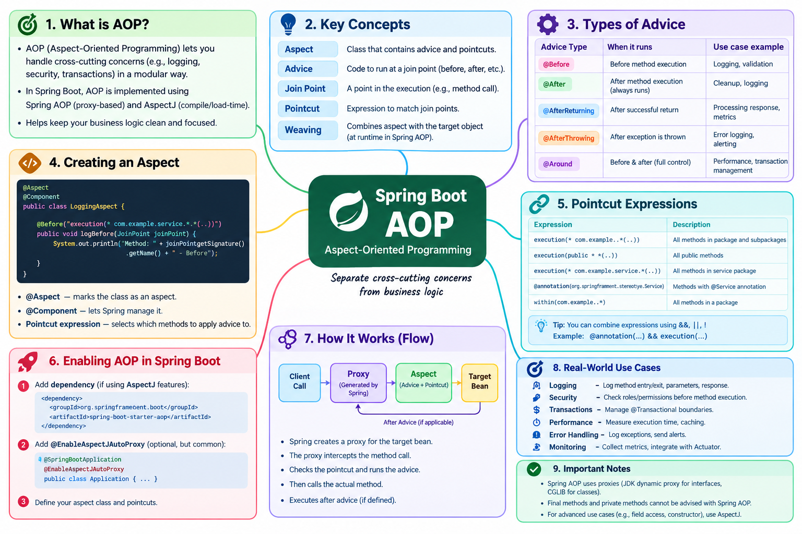

# Lesson 16-02 — AOP — Aspect-Oriented Programming



## 🎯 Learning Objective

Understand AOP — one of Spring's most powerful features. Understand how `@Transactional`, `@Cacheable`, and `@Async` actually work internally through AOP. Build your own aspect.

---

## 🤔 Think Before Reading

You want to log the execution time of every public service method in your application.

Without AOP, you'd need to add this to EVERY method:

```java
public UserResponse findById(Long id) {
    long start = System.currentTimeMillis();
    // ... actual code
    long duration = System.currentTimeMillis() - start;
    log.info("findById took {}ms", duration);
}
```

**Question**: Is there a way to add this behavior to every method WITHOUT modifying every method?

---

## 🔍 What AOP Solves

AOP handles **cross-cutting concerns** — behavior that should apply across many classes but isn't core business logic:

- Logging (every service method)
- Performance metrics (every endpoint)
- Transaction management (every `@Transactional` method)
- Caching (every `@Cacheable` method)
- Security (every `@PreAuthorize` method)
- Audit logging (every modification)

Without AOP: scattered, duplicated code everywhere.
With AOP: defined once in an **Aspect**, applied everywhere.

---

## 🔍 AOP Terminology

| Term | Meaning |
|------|---------|
| **Aspect** | The class containing cross-cutting behavior |
| **Advice** | The actual code to run |
| **Pointcut** | The rule that defines WHERE to apply advice |
| **Join Point** | A specific execution point in your code (a method call) |
| **Weaving** | The process of applying aspects to code |

```
@Aspect class = Aspect
@Around / @Before / @After = Advice type
execution(* com.example.service.*.*(..)) = Pointcut
UserService.findById() being called = Join Point
Proxy creation at startup = Weaving
```

---

## 🔍 Advice Types

```java
@Before     // Runs before the method
@After      // Runs after (always, regardless of exception)
@AfterReturning  // Runs after successful return
@AfterThrowing   // Runs after exception
@Around     // Wraps the method — full control, most powerful
```

---

## 💻 Your First Aspect

```java
package com.example.taskapi.aspect;

import lombok.extern.slf4j.Slf4j;
import org.aspectj.lang.ProceedingJoinPoint;
import org.aspectj.lang.annotation.*;
import org.springframework.stereotype.Component;

@Aspect
@Component // Must be a Spring bean
@Slf4j
public class LoggingAspect {
    
    // Pointcut: any public method in any class in the service package
    @Pointcut("execution(public * com.example.taskapi.service.*.*(..))")
    public void serviceLayer() {}
    
    // Around advice: runs AROUND every service method
    @Around("serviceLayer()")
    public Object logExecutionTime(ProceedingJoinPoint joinPoint) throws Throwable {
        String methodName = joinPoint.getSignature().toShortString();
        log.info("→ Starting: {}", methodName);
        
        long start = System.currentTimeMillis();
        
        try {
            Object result = joinPoint.proceed(); // Call the actual method
            long duration = System.currentTimeMillis() - start;
            log.info("✓ Completed: {} in {}ms", methodName, duration);
            return result;
            
        } catch (Throwable ex) {
            long duration = System.currentTimeMillis() - start;
            log.error("✗ Failed: {} in {}ms — {}", methodName, duration, ex.getMessage());
            throw ex; // Re-throw — don't swallow
        }
    }
    
    // Before advice: log method arguments
    @Before("serviceLayer()")
    public void logArguments(org.aspectj.lang.JoinPoint joinPoint) {
        Object[] args = joinPoint.getArgs();
        log.debug("  Arguments: {}", java.util.Arrays.toString(args));
    }
}
```

---

## 🔍 Pointcut Expression Language

```java
// execution(modifiers? return-type declaring-type? method-name(params) throws?)

// Any method in TaskService
execution(* com.example.taskapi.service.TaskService.*(..))

// Any public method in any service class
execution(public * com.example.taskapi.service.*.*(..))

// Methods returning TaskResponse
execution(com.example.taskapi.dto.TaskResponse com.example.taskapi.service.*.*(..))

// Methods named "find*"
execution(* com.example.taskapi.service.*.find*(..))

// Methods with @Transactional annotation
@annotation(org.springframework.transaction.annotation.Transactional)

// Classes with @Service annotation
within(@org.springframework.stereotype.Service *)

// Combine with && || !
@Pointcut("execution(* com.example.service.*.*(..)) && !execution(* com.example.service.*.find*(..))")
public void nonReadServiceMethods() {}
```

---

## 💻 Audit Logging Aspect

```java
@Aspect
@Component
@Slf4j
public class AuditAspect {
    
    private final AuditRepository auditRepository;
    
    public AuditAspect(AuditRepository auditRepository) {
        this.auditRepository = auditRepository;
    }
    
    // Intercept methods annotated with @Auditable
    @AfterReturning(
        pointcut = "@annotation(auditable)",
        returning = "result"
    )
    public void auditAction(JoinPoint joinPoint, Auditable auditable, Object result) {
        String action = auditable.action();
        String userId = getCurrentUserId();
        String methodName = joinPoint.getSignature().getName();
        
        AuditLog log = new AuditLog(userId, action, methodName, LocalDateTime.now());
        auditRepository.save(log);
        
        log.info("Audited: {} by user {}", action, userId);
    }
    
    private String getCurrentUserId() {
        Authentication auth = SecurityContextHolder.getContext().getAuthentication();
        if (auth == null) return "SYSTEM";
        return auth.getName();
    }
}

// Custom annotation
@Target(ElementType.METHOD)
@Retention(RetentionPolicy.RUNTIME)
public @interface Auditable {
    String action();
}

// Usage
@Service
public class TaskService {
    
    @Auditable(action = "TASK_CREATED")
    @Transactional
    public TaskResponse createTask(CreateTaskRequest request) { ... }
    
    @Auditable(action = "TASK_DELETED")
    @Transactional
    public void deleteTask(Long id) { ... }
}
```

---

## 🔍 How @Transactional Uses AOP Internally

`@Transactional` is implemented as an AOP aspect:

```
Simplified Spring @Transactional AOP:

@Around("@annotation(transactional)")
public Object handleTransaction(ProceedingJoinPoint pjp, Transactional tx) throws Throwable {
    TransactionStatus status = transactionManager.getTransaction(tx);
    
    try {
        Object result = pjp.proceed(); // Your actual method
        transactionManager.commit(status);
        return result;
    } catch (RuntimeException ex) {
        transactionManager.rollback(status);
        throw ex;
    }
}
```

This is why:
- `@Transactional` on private methods doesn't work (proxy can't intercept them)
- Self-invocation doesn't work (calling `this.method()` bypasses the proxy)
- Adding `@Transactional` to a class that's not a Spring bean has no effect

The proxy is the key to ALL of this.

---

## 💻 Exception Handling Aspect

```java
@Aspect
@Component
@Slf4j
public class ExceptionTranslationAspect {
    
    @Around("within(@org.springframework.stereotype.Repository *)")
    public Object translateException(ProceedingJoinPoint pjp) throws Throwable {
        try {
            return pjp.proceed();
        } catch (SQLException ex) {
            if (ex.getSQLState().startsWith("23")) { // Integrity constraint violation
                throw new DataIntegrityException("Database constraint violated: " + ex.getMessage(), ex);
            }
            throw new DataAccessException("Database error", ex);
        }
    }
}
```

Interestingly, Spring's `@Repository` already does something similar — it translates low-level JPA/JDBC exceptions into Spring's `DataAccessException` hierarchy. This is one of `@Repository`'s key functions beyond being a stereotype annotation.

---

## 💥 Break It Exercise

```java
@Service
public class CacheService {
    
    // AOP pointcut targets service methods
    // @Cacheable is applied via AOP
    @Cacheable("users")
    public User findById(Long id) {
        log.info("Fetching user from DB...");
        return userRepository.findById(id).orElseThrow();
    }
    
    public User findByIdCached(Long id) {
        return this.findById(id); // Self-invocation!
    }
}
```

**Question**: The second time `findByIdCached(1L)` is called, will `findById()` hit the cache?

<details>
<summary>Answer</summary>

**No** — because `findByIdCached` calls `this.findById(id)` via self-invocation.

`@Cacheable` is implemented via AOP proxy. When you call `this.findById()`, you bypass the proxy — the cache is never consulted. Every call hits the database.

**Fix**: Extract `findById` to a separate service class, so the call goes through the proxy.

Or use Spring's `@EnableCaching` with `proxyTargetClass = true` and avoid self-invocation.

This is the SAME self-invocation problem as `@Transactional` — the root cause is the same proxy mechanism.

</details>

---

## ✅ Completion Checklist

- [ ] Can you explain what AOP is and what problem it solves?
- [ ] Can you write an `@Aspect` with `@Around`, `@Before`, `@AfterReturning`?
- [ ] Can you write pointcut expressions?
- [ ] Can you explain how `@Transactional` uses AOP internally?
- [ ] Can you explain why self-invocation defeats AOP?
- [ ] Did you implement the LoggingAspect and test it?

---

*Next: [22-01 — Spring Core Interview Preparation](../22-interview-preparation/01-spring-core-interview.md)*
